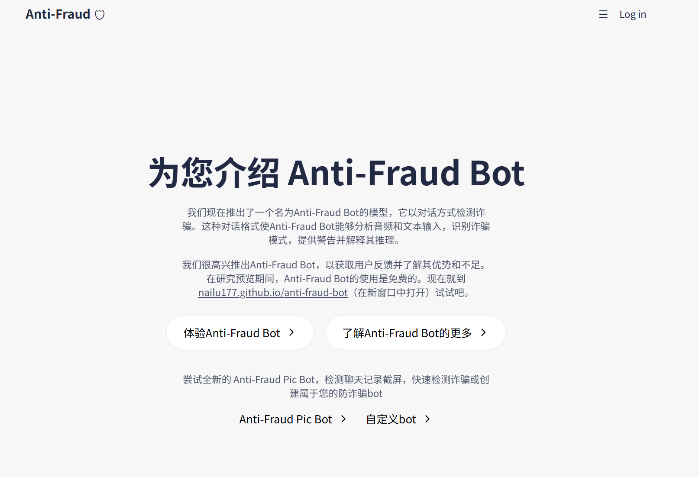
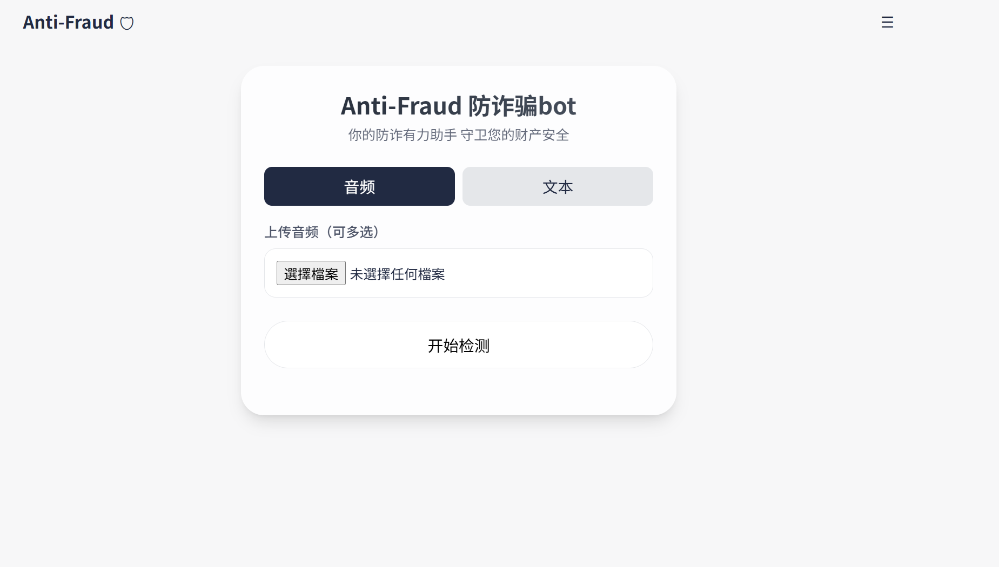
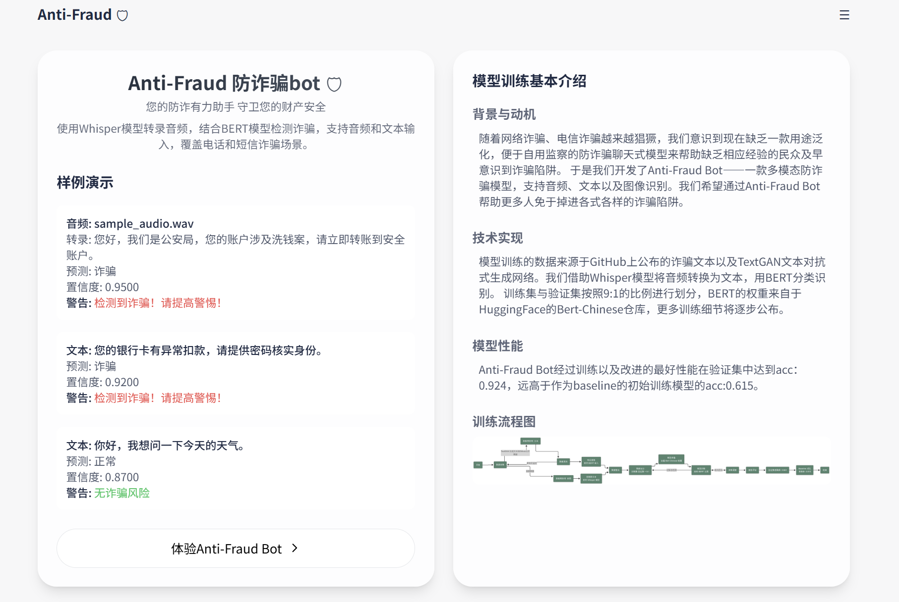

# Anti-Fraud Bot

**防诈骗多模态检测工具**，通过 **OCR** 和 **BERT**、**WHISPER** 模型检测音频、图片或文本中的诈骗风险。

---

## 使用流程

需要说明，需要自行补充一些资源（如 Tesseract 的安装），并且流程中的本地端口为默认情况，如您的本地端口不同请自行修改。

### 1. 创建虚拟环境

首先，使用 **Python 3.10** 创建虚拟环境：

```bash
python -m venv venv
source venv/bin/activate  # Linux/Mac
venv\Scripts\activate     # Windows
```

### 2. 安装依赖

安装项目所需的库：

```bash
pip install -r requirements.txt
```

---

## 项目结构

```
backend
|- __pycache__          # Python 缓存文件夹
|- bert-base-chinese    # BERT 中文模型文件夹
|- .gitattributes       # Git 属性文件
|- bert_classifier.pt   # 预训练 BERT 分类模型
|- flask_app.py         # Flask 后端主文件
|- requirements.txt     # 依赖文件
|- test.py              # 测试脚本
```

---

## 本地部署

### 1. 运行 Flask 后端

启动后端服务：

```bash
python flask_app.py
```

### 2. 启动前端服务

在项目根目录运行本地服务器：

```bash
python -m http.server 8000
```

### 3. 访问应用

打开浏览器，访问：

```bash
http://localhost:8000/
```

即可开始使用本软件。

---

## 界面演示

### 初始界面

启动应用后，显示概览界面：



### 文本及音频检测

上传音频后，显示识别的文本和劝导信息：



### 相关介绍

关于anti-fraud bot的更多细节：


